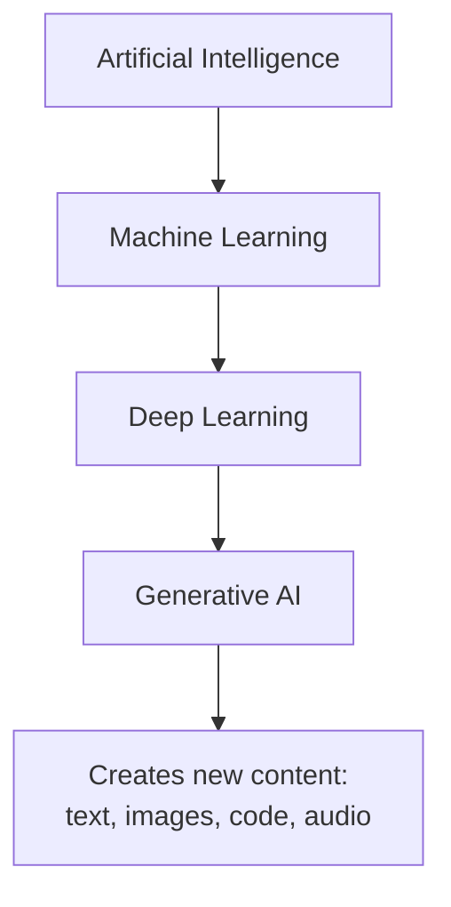
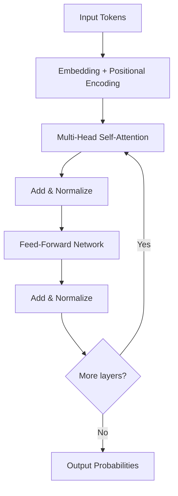

# Module 1 — Generative AI Foundations

## 🗺️ Where GenAI fits

## 🧠 Inside a Transformer block

## AI vs ML vs DL vs GenAI
- **AI (Artificial Intelligence)** — the broad field of making machines perform tasks that normally require human intelligence.
- **ML (Machine Learning)** — a subset of AI where systems learn patterns from data instead of being explicitly programmed.
- **DL (Deep Learning)** — a subset of ML using multi-layer neural networks, good at learning from unstructured data (text, images, audio).
- **GenAI (Generative AI)** — a subset of DL focused on *generating* new content (text, images, code, audio) rather than just classifying or predicting.

## Large Language Models (LLMs)
LLMs are deep learning models trained on massive text corpora to predict the
next token in a sequence. At scale, this next-token prediction gives rise to
emergent capabilities: reasoning, summarization, translation, code generation,
and more. Key properties:
- **Parameters** — the learned weights; more parameters generally means more
  capacity, but also higher cost/latency.
- **Context window** — how much text (tokens) the model can consider at once.
- **Fine-tuning vs. prompting** — you can adapt a base model's behavior either
  by further training it on your data (fine-tuning) or by carefully
  structuring the input at inference time (prompting) — the latter is cheaper
  and is the basis for RAG and agents.

## Transformer architecture
The Transformer (Vaswani et al., 2017) is the architecture behind nearly all
modern LLMs. Core ideas:
- **Self-attention** — lets each token in a sequence "look at" every other
  token and weigh how relevant they are to it, rather than processing text
  strictly left-to-right like older RNNs.
- **Multi-head attention** — runs several attention computations in parallel
  so the model can capture different types of relationships (syntax,
  coreference, long-range dependencies) simultaneously.
- **Positional encoding** — since attention has no inherent sense of word
  order, position information is injected explicitly.
- **Feed-forward layers + residual connections** — stacked after attention in
  each block, with residual connections and layer norm to stabilize training
  of very deep networks.
- **Encoder vs. decoder** — encoder-only models (e.g. BERT) are good for
  understanding tasks; decoder-only models (e.g. GPT-family) are
  autoregressive generators and are what most modern LLMs use.

## Why this matters for the rest of the course
Everything downstream — prompting, RAG, agents, deployment — is about working
*around* the LLM's core limitations: fixed context window, fixed training
cutoff, and no built-in way to take actions in the world.
