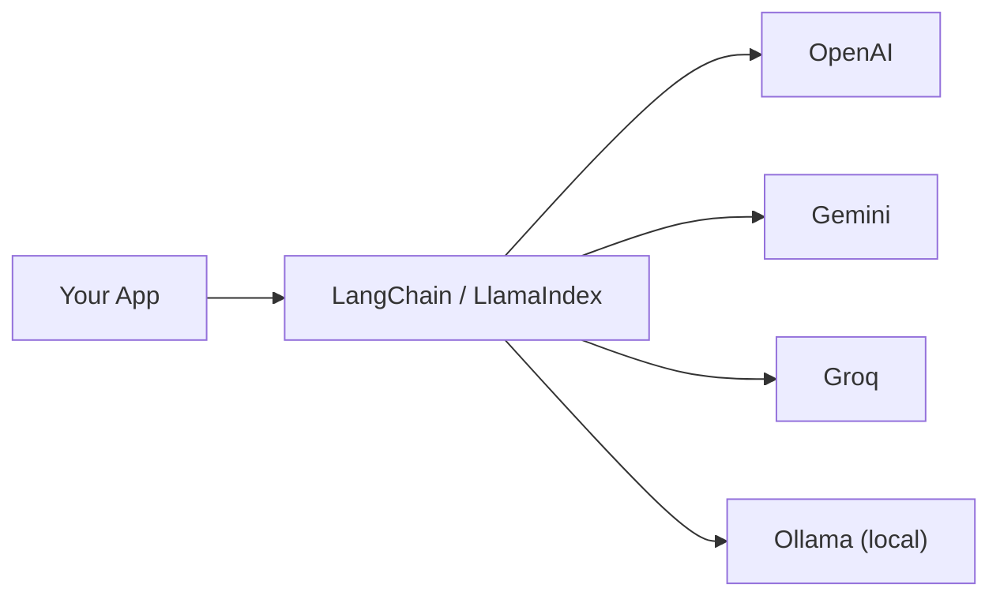

# Module 2 — Accessing LLMs in Python

## 🔌 One interface, many providers

## Providers covered
- **OpenAI** (proprietary) — GPT-family models via the OpenAI API.
- **Gemini** (proprietary) — Google's model family.
- **Groq** (open-source models, fast inference) — serves open models (e.g.
  Llama, Mixtral) on custom LPU hardware for very low latency.
- **Ollama** (open-source, local) — runs open-weight models entirely on your
  own machine; useful for privacy, offline dev, and zero API cost.

## Direct SDK access vs. a framework
You *can* call each provider's SDK directly, but every provider has a
slightly different request/response format. Frameworks like **LangChain**
and **LlamaIndex** provide a unified interface so you can swap models/providers
with minimal code changes, plus higher-level building blocks (chains,
retrievers, agents, memory) on top.

- **LangChain** — general-purpose orchestration: chains, agents, memory,
  tool-calling, broad integration ecosystem. Used for the chatbot, RAG, and
  agent modules in this repo.
- **LlamaIndex** — originally focused on data ingestion/indexing for RAG;
  strong at connecting LLMs to structured/unstructured data sources.

## Practical takeaway
Pick the framework/provider combo based on the constraint that matters most
for the task: cost (open-source + Ollama/Groq), latency (Groq), capability
ceiling (frontier proprietary models), or data privacy (local Ollama).

See `access_llms_example.py` for a minimal example that swaps between
providers using LangChain's unified interface.
