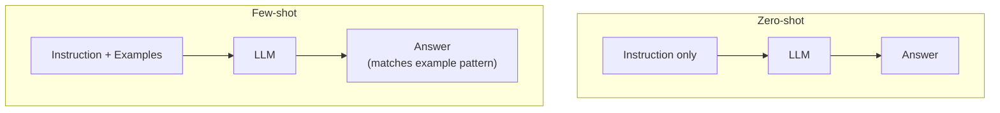

# Module 3 — Prompt Engineering

## ✍️ Zero-shot vs Few-shot

## Prompt templates
Rather than hardcoding a full prompt string per request, a **prompt template**
defines a reusable structure with placeholders (e.g. `{question}`,
`{context}`) that get filled in at runtime. This keeps prompts consistent,
testable, and easy to version.

## Zero-shot prompting
Asking the model to perform a task with **no examples**, relying entirely on
its pretrained knowledge and the instruction itself.
- Pros: fastest to write, no example curation needed.
- Cons: less reliable for tasks with a specific desired format or style,
  since the model has to guess your intent from the instruction alone.

## Few-shot prompting
Providing **a small number of input/output examples** in the prompt before
the actual query, so the model can infer the pattern you want.
- Pros: much more reliable output format/style; effectively "teaches" the
  task in-context without any fine-tuning.
- Cons: uses more tokens (cost + context budget); example quality and order
  can bias the output.

## When to use which
- Zero-shot: general questions, summarization, simple classification.
- Few-shot: strict output formats (e.g. structured JSON), tasks with
  nuanced/ambiguous instructions, or when zero-shot output quality is
  inconsistent.

See `prompt_templates.py` for zero-shot vs. few-shot examples side by side.
