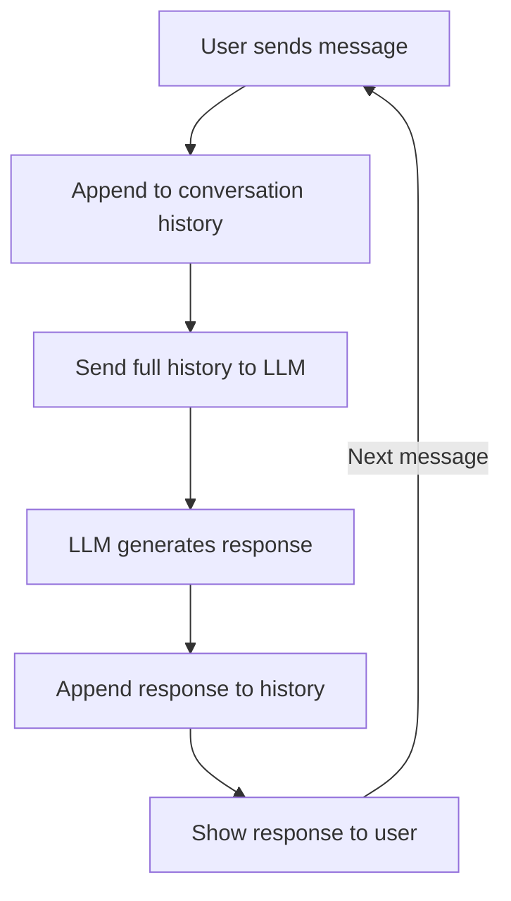

# Module 4 — Building GenAI Chatbots

## 💬 The chat loop

## From single prompt to chatbot
A chatbot adds **conversation memory** on top of a raw LLM call — each new
message is sent along with the prior turns so the model has context. Without
this, every message would be answered in isolation with no memory of what was
said before.

## Building blocks
- **Message history** — a running list of (role, content) pairs: system,
  human, AI. Passed to the LLM on every turn.
- **System prompt** — sets persona, tone, and constraints for the whole
  conversation (e.g. "You are a concise, friendly support assistant").
- **UI layer (Streamlit)** — turns the chat loop into something a
  non-technical user can actually interact with, with minimal frontend code.
- **Deployment (Streamlit Cloud)** — one-click hosting for a Streamlit app
  directly from a GitHub repo, useful for demos and prototypes before moving
  to a more production-grade deployment (see Module 7).

## Design notes
- **Context window limits** — long conversations eventually exceed the
  model's context window; production chatbots need a truncation or
  summarization strategy for old messages.
- **Streaming responses** — improves perceived latency by showing tokens as
  they're generated rather than waiting for the full response.
- **Statelessness on the backend** — the LLM itself has no memory between
  calls; all "memory" is really just re-sending the conversation history.

See `chatbot_streamlit.py` for a minimal LangChain + Streamlit chatbot.
