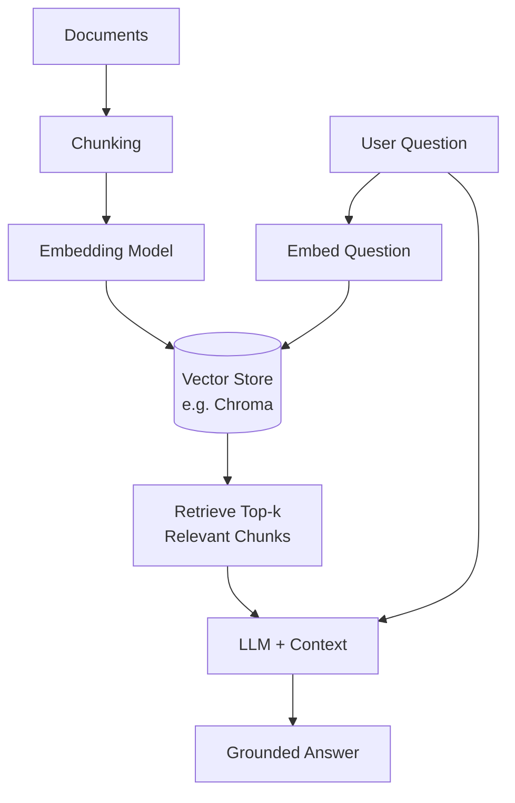

# Module 5 — Retrieval-Augmented Generation (RAG)

## 📚 The RAG pipeline

## Why RAG?
LLMs have a fixed knowledge cutoff and can hallucinate. RAG grounds responses in
your own documents by retrieving relevant chunks at query time and feeding them
into the prompt as context.

## Pipeline stages
1. **Load** — pull in raw documents (PDF, txt, web pages, etc.)
2. **Chunk** — split documents into overlapping windows (e.g. 500 tokens, 50 overlap)
   so retrieval returns focused, relevant context instead of whole documents.
3. **Embed** — convert each chunk into a vector using an embedding model.
4. **Store** — persist vectors in a vector database (Chroma, FAISS, Pinecone, etc.)
5. **Retrieve** — embed the incoming query, do a similarity search (cosine/L2) to
   pull the top-k most relevant chunks.
6. **Generate** — pass the retrieved chunks + original question to the LLM as
   context and ask it to answer using only that context.

## Key trade-offs
- **Chunk size** — smaller chunks = more precise retrieval but less context per chunk.
- **Overlap** — prevents important info from being split across chunk boundaries.
- **Top-k** — too few chunks misses info; too many dilutes the prompt and raises cost.
- **Embedding model choice** — affects retrieval quality and cost/latency.

## Common failure modes
- Retrieving irrelevant chunks because the embedding model doesn't capture domain-specific meaning well.
- The LLM ignoring provided context and answering from its own (possibly outdated) knowledge — mitigated with strict prompting ("answer only using the context below").
- Stale vector store when source documents update — needs a re-indexing strategy.

## LangChain vs. LlamaIndex for RAG
Both frameworks can build the same pipeline above; the course covers both:
- **LangChain** — more general-purpose; RAG is one of many chain types, so it
  fits naturally if the same app also needs agents, memory, or tool use.
- **LlamaIndex** — purpose-built for data ingestion and indexing; often less
  boilerplate for pure retrieval-heavy apps (e.g. a PDF Q&A bot).

## PDF Q&A app
The course's Streamlit PDF Q&A app follows the exact same pipeline (load →
chunk → embed → store → retrieve → generate), just with a PDF loader in place
of a plain text loader, and a Streamlit UI for file upload + chat.

See `rag_pipeline_langchain.py` for a minimal working LangChain implementation.

