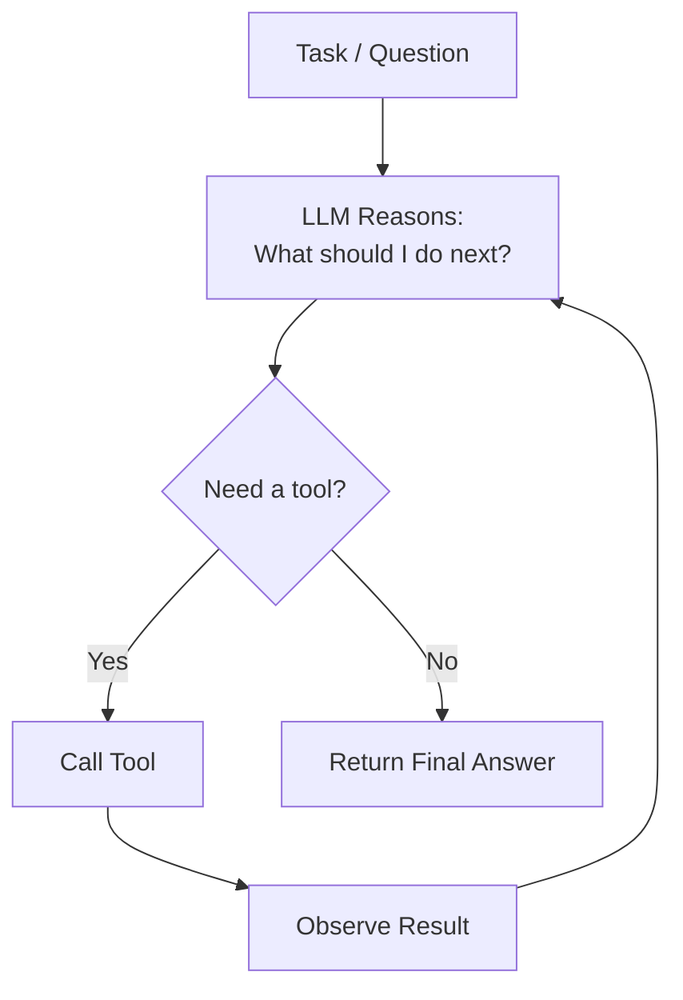

# Module 6 — AI Agents

## 🕵️ The ReAct loop (Reason → Act → Observe)



## What makes something an "agent"?
An agent is an LLM given:
1. **Tools** — functions it can call (search, calculator, database query, API call)
2. **A reasoning loop** — the ability to decide *which* tool to use, call it,
   observe the result, and decide the next step (often called a ReAct loop:
   Reason → Act → Observe, repeated until done).
3. **Memory** (optional) — short-term conversation state, or long-term memory
   across sessions.

## Why agents instead of a single prompt?
A single LLM call can't look things up, do precise math reliably, or take
multi-step actions in the world. Agents break a task into steps, use tools for
the parts LLMs are bad at (exact computation, live data), and use the LLM for
the parts it's good at (planning, language, judgment).

## Core loop (simplified)
```
while task not done:
    thought = llm.reason(current_state)
    if thought requires a tool:
        result = call_tool(thought.tool_name, thought.tool_input)
        current_state += result
    else:
        return thought.final_answer
```

## Design considerations
- **Tool descriptions matter a lot** — the LLM picks a tool based on its
  description, so vague descriptions cause wrong tool selection.
- **Guardrails** — agents that can take real-world actions (send emails, make
  purchases) need confirmation steps or strict permission scoping.
- **Loop limits** — always cap the number of reasoning steps to avoid infinite
  loops or runaway API costs.
- **Observability** — log every thought/action/observation step; agents fail
  in non-obvious ways and you need the trace to debug them.

## Frameworks covered
- **PydanticAI** — agent framework built on Pydantic; strong typing for tool
  inputs/outputs and structured agent responses, good for production
  reliability.
- **Microsoft AutoGen** — multi-agent conversations where agents can talk to
  each other (not just tools) to solve a task collaboratively.
- **CrewAI** — role-based multi-agent orchestration: you define a "crew" of
  agents each with a role, goal, and backstory, and a process for how they
  hand off work (sequential or hierarchical).

## Single-agent vs. multi-agent
A single agent with several tools works well for tasks that decompose into a
linear tool-use sequence. Multi-agent systems (AutoGen, CrewAI) help when a
task benefits from *specialization* — e.g. a "researcher" agent, a "writer"
agent, and a "reviewer" agent each doing what they're best at, coordinated by
an orchestrator.

See `agent_example.py` for a minimal single-agent, tool-calling example built
with LangChain (the same core ReAct loop concepts apply across PydanticAI,
AutoGen, and CrewAI — they differ mainly in how multi-agent coordination and
structured I/O are handled).
