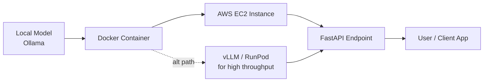

# Module 7 — LLM Deployment

## 🚀 From laptop to the internet

## From notebook to service
A RAG pipeline or agent is only useful to others once it's exposed behind an
API. This module wraps the Module 5 RAG chain in a FastAPI service and
containerizes it with Docker — the same pattern used for the capstone
projects, just pointed at a hosted LLM instead of a local one below.

## Local & self-hosted serving options covered
- **Ollama** — runs open-weight models locally with a simple CLI/API; good
  for dev and for privacy-sensitive workloads.
- **Docker** — packages Ollama (or any serving stack) into a portable,
  reproducible container image.
- **AWS EC2** — rents a cloud VM (with GPU if needed) to run the Docker
  container so the model is reachable over the internet rather than just
  localhost.
- **vLLM** — a high-performance inference server with continuous batching and
  paged attention, used when you need much higher throughput than a basic
  Ollama server (production-grade self-hosted serving).
- **RunPod** — a cost-effective GPU rental platform, useful as a cheaper
  alternative to EC2 for GPU-heavy workloads like serving larger open models.

## Choosing a deployment path
| Option | Best for |
|---|---|
| Ollama (local) | Local dev, no cost, privacy |
| Ollama + Docker on EC2 | Small-to-medium production workloads, full control |
| vLLM on EC2 | High-throughput production serving |
| RunPod | Cost-sensitive GPU workloads, on-demand scaling |
| Managed API (OpenAI/Gemini/Groq) | Fastest to ship, no infra to manage |

## Key pieces
1. **API layer (FastAPI)** — defines an HTTP endpoint (`POST /ask`) that
   accepts a question and returns a grounded answer. FastAPI gives request
   validation (via Pydantic) and auto-generated docs for free.
2. **Statelessness** — the vector store is loaded once at startup rather than
   rebuilt per-request, so requests stay fast.
3. **Containerization (Docker)** — packages the app with its exact Python
   version and dependencies so it runs identically in dev, staging, and prod.
4. **Environment config** — secrets (API keys) are injected via environment
   variables at runtime, never hardcoded or committed.

## Production considerations (beyond this demo)
- **Latency** — cache embeddings, use async I/O for LLM calls, consider a
  smaller/faster model for latency-sensitive paths.
- **Rate limiting & auth** — protect the endpoint from abuse and unauthorized use.
- **Observability** — structured logging, request tracing, and cost/token
  tracking per request.
- **Scaling** — run multiple stateless replicas behind a load balancer; keep
  the vector store as an external service (not baked into each container) once
  data grows beyond what fits comfortably in one instance.
- **CI/CD** — automate build → test → deploy on every push (e.g. GitHub Actions).

See `deploy_fastapi.py` and `Dockerfile`.
