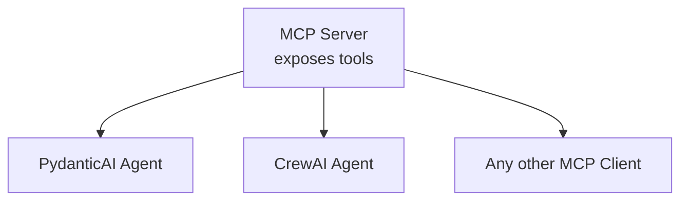

# Module 8 — Model Context Protocol (MCP)

## 🔗 One server, many agents

## What is MCP?
The Model Context Protocol is an open standard for connecting AI applications
to external tools and data sources through a consistent interface — instead
of writing custom, one-off integration code for every tool an agent needs,
you build (or use) an **MCP server** that exposes tools/resources in a
standard way, and any MCP-compatible client (agent framework, chat app) can
use it without custom glue code.

## Why it matters for agents
Without MCP, every agent framework (PydanticAI, AutoGen, CrewAI, LangChain)
has its own way of defining and registering tools. MCP decouples "the tool"
from "the framework using it" — build one MCP server for, say, a database or
an internal API, and it becomes usable by any MCP-aware agent, regardless of
which framework built that agent.

## Core pieces
- **MCP server** — exposes one or more tools (and optionally resources/
  prompts) over a standard protocol (stdio or HTTP/SSE transport).
- **MCP client** — the agent framework side that discovers and calls the
  server's tools.
- **Tool schema** — each tool declares its name, description, and input
  schema, which the calling LLM uses to decide when/how to invoke it (same
  principle as the "tool descriptions matter a lot" note in Module 6).

## What the course builds
- A basic MCP server exposing a couple of tools.
- A PydanticAI agent consuming that MCP server's tools.
- A CrewAI agent consuming the same MCP server — demonstrating the
  framework-agnostic reuse that's the whole point of MCP.

See `mcp_server_example.py` for a minimal MCP server skeleton.
